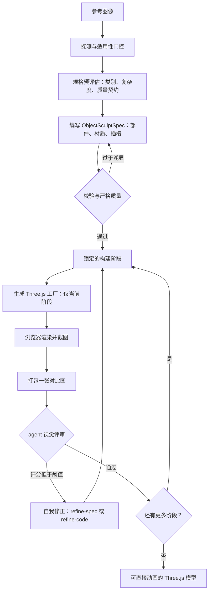

<div align="center">


# img2threejs

**将参考图中的物体，以纯代码、程序化的方式重建为 Three.js 模型。**

经过质量门控、可直接用于动画，并刻意做到省 token —— 通过代码重建，而非摄影测量、网格提取或下载素材包。

[](https://github.com/img2threejs/img2threejs/blob/main/LICENSE)
[](https://github.com/img2threejs/img2threejs/blob/main/SKILL.md)
[](https://github.com/img2threejs/img2threejs/blob/main/CONTRIBUTING.md)
[](https://threejs.org)
[](https://github.com/img2threejs/img2threejs/tree/main/scripts)

<a href="https://trendshift.io/repositories/83608?utm_source=trendshift-badge&amp;utm_medium=badge&amp;utm_campaign=badge-trendshift-83608" target="_blank" rel="noopener noreferrer"></a>


</div>

*一张参考图像，通过代码重建为 —— 比例正确、配色、倒角、金色镶边，以及发光徽记 —— 在浏览器中实时运行。*

### [→ 打开在线演示画廊](https://img2threejs-showcase.pages.dev/)

画廊中的每一个模型都是生成的代码，在你的浏览器中实时运行。没有网格文件，无需下载。

---

## 在线演示

完全由基础几何体、程序化着色器和生成的几何结构构建的重建模型。下面的片段是在浏览器中实时运行的模型 —— 打开任意一个即可环绕查看并阅读生成的源码。

| 演示 | 预览 | 主题 | 查看 | 源码 |
| --- | --- | --- | --- | --- |
| Sony WF-1000XM3 耳机 + 充电盒 |  | 硬表面物体 | [在线](https://img2threejs-showcase.pages.dev/#/demo/sony-wf1000xm3) | [代码](https://github.com/img2threejs/img2threejs-showcase/blob/main/src/demos/sony-wf1000xm3/createSonyWf1000xm3Model.ts) |
| ISSACA 12 号口径霰弹枪 |  | 硬表面物体 | [在线](https://img2threejs-showcase.pages.dev/#/demo/issaca-shotgun) | [代码](https://github.com/img2threejs/img2threejs-showcase/blob/main/src/demos/issaca-shotgun/createIssacaShotgunModel.ts) |
| Gerber 伞绳刀 |  | 硬表面物体 | [在线](https://img2threejs-showcase.pages.dev/#/demo/gerber-knife) | [代码](https://github.com/img2threejs/img2threejs-showcase/blob/main/src/demos/gerber-knife/createGerberKnifeModel.ts) |
| 哆啦 A 梦之家（等距微缩场景） |  | 硬表面物体 | [在线](https://img2threejs-showcase.pages.dev/#/demo/doraemon-house) | [代码](https://github.com/img2threejs/img2threejs-showcase/blob/main/src/demos/doraemon-house/createDoraemonHouseModel.ts) |
| 战列运输车 "SECTOR 07" |  | 硬表面物体 | [在线](https://img2threejs-showcase.pages.dev/#/demo/warhauler) | [代码](https://github.com/img2threejs/img2threejs-showcase/blob/main/src/demos/warhauler/createWarHaulerModel.ts) |
| 加冕宝箱 |  | 硬表面物体 | [在线](https://img2threejs-showcase.pages.dev/#/demo/crown-chest) | [代码](https://github.com/img2threejs/img2threejs-showcase/blob/main/src/demos/crown-chest/createCrownChestModel.ts) |

画廊的源码位于 [img2threejs/img2threejs-showcase](https://github.com/img2threejs/img2threejs-showcase)。如果这个项目对你有用，给仓库点个 star 能帮更多人发现它。

---

## 功能简介

你给它一张物体的参考图。它会生成一个用 TypeScript 编写的 `THREE.Group` 工厂函数，通过基础几何体、程序化着色器和生成的几何结构来重现该物体 —— 并附带一套运行时层级结构（pivots 枢轴、sockets 插槽、colliders 碰撞体），让结果可以直接用于动画，而不是一块死物。

它可运行于 Claude Code、Codex 或 OpenCode 之上。它是与具体 agent 无关的：文档中凡是提到“agent 视觉”或“agent 浏览器工具”的地方，都会使用宿主所提供的任意能力 —— 原生图像读取、浏览器 MCP、项目预览，或是用户提供的截图。

### 主题与细节精度

- **物体与角色。** 每个主题会被分类为 `object`（物体）、`character`（角色）或 `hybrid`（混合）。物体走硬表面流水线；角色则进入一个具备解剖学意识的轨道（头身比例、面部关键点、姿态），详见 `https://github.com/img2threejs/img2threejs/blob/main/grimoire/character/reconstruction.md`。
- **细节优先分析。** 在生成代码之前，流水线会枚举出一份 `detailInventory`（身份定义性小细节清单），包含：光泽、倒角/圆角、螺丝/铆钉、雕刻或喷涂的线条、轮廓、污渍与磨损。每一个细节都必须对应到一个真实的部件或材质条目，并且一道严格质量门会在清单补全之前阻止生成。分类法详见：`https://github.com/img2threejs/img2threejs/blob/main/grimoire/intake/detail_inventory.md`。
- **针对特定人物/角色的最大相似度。** 一条可选的“投影优先”路径会将参数化模板拟合到图像关键点，对照片去光、相机匹配渲染，并将参考图投影到网格上。单张图像无法保证 100% 的相似度，因此流水线会按区域报告置信度，并在关键处请求更多视角。详见：`https://github.com/img2threejs/img2threejs/blob/main/grimoire/character/likeness_maximization.md`。

---

## 工作原理

该 skill 运行一条分阶段的雕刻流水线。脚本负责管控每个阶段；只有 agent 的视觉判断才能批准一个阶段通过。



### 构建阶段

模型按固定顺序雕刻；一个阶段只有在前一个被评审并接受后才会解锁：

`草图 → 结构阶段 → 形态精修 → 材质阶段 → 表面阶段 → 光照阶段 → 交互阶段 → 优化阶段`

每个阶段都有自己的验收标准。一个阶段被标记为 `continue`（继续）的前提是：有真实渲染、有对比图、agent 视觉评分达到或超过阈值，并且每个身份定义性特征都达到或超过其各自的阈值。

### 各道门控

- **适用性** —— 这张图到底是不是一个可行的 3D 目标。
- **规格预评估与严格质量** —— 在规格足够深入、匹配物体复杂度之前阻止代码生成（复合物体不允许只有一个根的规格）。
- **截图反馈** —— `continue` 需要一次渲染、一张对比图，外加一个通过的视觉评分。
- **可交互就绪** —— 模型通过 `root.userData.sculptRuntime` 暴露出运行时层级（枢轴、插槽、碰撞体、销毁组）。
- **连接正确性** —— 子部件（把手、四肢、管道）需声明它们如何连接到父级，从而没有任何东西悬空漂浮。
- **材质与光照真实感** —— 独立的 PBR 通道与真实灯光，绝不让 albedo（反照率）被混入 roughness（粗糙度）。

### 自我修正

每个阶段结束后，agent 只会选择且仅选择一种动作：`continue`、`refine-spec`、`refine-code`、`request-input` 或 `stop`。`refine-spec` 修正错误或过浅的规格并重新校验；`refine-code` 修正与正确规格不符的几何、材质或光照。

---

## 快速开始

1. **安装** —— 把这个文件夹放到你的 skills 目录下：

   ```bash
   git clone https://github.com/img2threejs/img2threejs.git ~/.claude/skills/img2threejs
   ```

2. **调用** —— 在 Claude Code 中，附上或指向一张物体图像，然后运行：

   ```
   /img2threejs Rebuild this object as a Three.js model, keep the proportions, angles, and colours.
   ```

   这样就够了：skill 会自行分类主题、运行细节清单，并对每个阶段进行门控。

3. **跟随流水线** —— skill 会校验图像、撰写评估与规格、逐阶段生成工厂函数，并在每一步都向你展示一张并排对比图，直到渲染与参考图一致。

### 更进一步使用

上面那句简短指令把判断权交给了 skill。当你已经清楚自己主题中“正确”的定义时，就明确说出来 —— 下面每一行都对应流水线中一道真实的门控或产物，因此它会改变实际被强制执行的规则，而不只是堆砌形容词：

```
/img2threejs 将这张图像中的主题重建为一个程序化的 Three.js 模型。

保真度   保持与参考图一致的比例与轮廓。先枚举出身份定义性的
        细节 —— 倒角与圆角、面板接缝、紧固件、雕刻或喷涂的
        线条、光泽与哑光区域、磨损 —— 并丢弃任何无法落实到
        真实部件上的细节，而不是去伪造它。
材质     从参考图像素中推导表面类别与渐变节点，而不是凭记忆。
        标记任何无法在色调映射中保留的颜色。
运行时   为所有应当活动的部分暴露枢轴与插槽，并附带一个用于
        循环待机动画的 userData.tick。
门控     运行 --strict-quality，并且在并排评审通过之前不推进
        任何阶段。对图像无法呈现的区域报告分区置信度。
```

根据主题可追加的有用指令：

- **特定人物或角色** —— `最大化相似度：将参数化模板拟合到关键点，去光并相机匹配参考图，再将其投影。告诉我是哪些区域是推断出来的。`
- **动物或生物** —— `这是一个生物而非人形 —— 使用四足身体结构方案与身体单元比例系统。`
- **高饱和的阳极氧化或糖果漆面** —— `这层涂层是糖果漆，不是宝石金属。保留色相；别让环境把它夺走。`
- **成本上限** —— `保持低投入，跳过展示合成器；我只想要评估渲染。`

这些脚本从 skill 根目录运行，仅需 Python 3.10+ —— 无需安装任何东西。

```bash
python3 forge/stage1_intake/probe_image.py <image>
python3 forge/stage2_spec/new_pre_spec_assessment.py "Name" --image <image> --out assessment.json
python3 forge/stage2_spec/new_sculpt_spec.py "Name" --image <image> --assessment assessment.json --out spec.json
python3 forge/stage2_spec/validate_sculpt_spec.py spec.json --strict-quality
python3 forge/stage3_build/generate_threejs_factory.py spec.json --out src/createObjectModel.ts
```

---

## 为什么它能省 token

大多数“图像转 3D”的 agent 循环都在浪费 token：它们让模型去做机械性的工作 —— 每个阶段都重读整个模型、给像素打分、手工校验 JSON、重复执行已经做过的步骤。img2threejs 把这一切都推进确定性的脚本里，只在真正需要判断力的地方消耗模型 token。

- **脚本负责执行，模型负责判断。** Python 脚本处理校验、门控、规格编写、PBR 提取、对比图打包以及流水线状态。它们从不给视觉打分。模型的 token 只花在一件事上：看一张并排对比图，并决定通过还是不通过。
- **零依赖，零安装折腾。** 每个脚本都是纯 Python 3.10+ 标准库。没有 pip，没有 PIL，没有 numpy，没有 Playwright。PNG 的读写用 `struct` 和 `zlib` 完成。无需安装，就意味着上下文中没有需要调试的东西。
- **阶段门控生成。** 代码生成器只输出当前已解锁的构建阶段。模型不会在每次迭代中重新生成或重读整个模型 —— 每一步都很小且范围明确。
- **快速失败，在代码生成之前。** 一道严格质量门会在生成任何一行 Three.js 代码之前，挡住过于浅显的规格，因此你永远不会把 token 浪费在渲染一个从一开始就规格不足的模型上。
- **每次评审只看一张图。** 每个阶段的评审都基于恰好一张打包好的对比图（参考图与渲染图并排），而不是一堆零散的截图。
- **文本输出，而非二进制。** 结果是一份可 diff 的 TypeScript 代码，外加一份 JSON 规格 —— 体积小、可审阅、可纳入版本控制，而不是几兆字节的网格文件。

最终效果：你依然能从一张图得到忠实的 3D 模型，但昂贵的模型上下文被保留给视觉判断与代码，而不是簿记工作。关于每个阶段、每个循环的完整 token 拆解，请参阅 [docs/TOKEN_COST.md](https://github.com/img2threejs/img2threejs/blob/main/docs/TOKEN_COST.md)。

---

## 脚本

| 脚本 | 职责 |
| --- | --- |
| `stage1_intake/probe_image.py` | 图像元数据与明显的技术问题（非视觉检查）。 |
| `stage2_spec/new_pre_spec_assessment.py` | 对物体分类、评估复杂度，并产出质量契约。 |
| `stage2_spec/new_sculpt_spec.py` | 基于评估编写 ObjectSculptSpec。 |
| `stage2_spec/validate_sculpt_spec.py` | 校验规格；`--strict-quality` 会在代码生成前挡住浅显的规格。 |
| `stage1_intake/extract_pbr_evidence.py` | 针对每个裁剪区域，从参考图推导 PBR 证据（推断，而非逆向渲染）。 |
| `stage3_build/orchestrate_passes.py` | 锁定的阶段状态：状态、检查、同步。 |
| `stage3_build/generate_threejs_factory.py` | 为当前已解锁阶段生成 Three.js `Group` 工厂。 |
| `stage4_review/make_comparison_sheet.py` | 打包一张“参考图 vs 渲染图”对比图供评审。 |
| `stage4_review/append_review.py` | 记录每次阶段的评审：评分、决策、证据。 |
| `_shared/feature_acceptance_policy.py` | 内部辅助脚本，强制执行每个特征的评分阈值。 |
| `stage1_intake/build_detail_inventory.py` | 将参考图切分为若干区域，并搭建细节清单。 |
| `stage1_intake/extract_landmarks.py` | 叠加关键点网格，并为角色搭建解剖学区块。 |
| `stage1_intake/solve_camera_pose.py` | 产出参考相机区块，使渲染能进行相机匹配。 |
| `stage1_intake/delight_albedo.py` | 在纹理投影前，从照片中近似出中性反照率。 |
| `stage3_build/bake_projected_texture.py` | 为照片纹理投影产出投影/UV 烘焙描述符。 |

该 `https://github.com/img2threejs/img2threejs/tree/main/grimoire` 文件夹保存着每道门控所依据的详细评分准则（校验、规格预评估、程序化模式、材质与光照真实感、连接正确性、可交互就绪模型、自我修正）。

---

## 你会得到什么

- 一份 `ObjectSculptSpec` JSON：完整的部件树、材质、重复系统、插槽，以及每个阶段被记录的评审历史。
- 一个 TypeScript 工厂函数 `createObjectNameModel(spec, options)`，返回 `THREE.Group`，并通过 `root.userData.sculptRuntime` 暴露节点、插槽、碰撞体与销毁组。
- 一份渲染图，外加记录每个阶段保真度的对比图。

---

## 路线图

**已发布：**

- **v1.0** —— 物体流水线：分阶段雕刻、渲染对比参考图的评审循环、可交互就绪的层级结构。
- **v1.1** —— 细节优先分析：强制性的细节清单、严格质量门。
- **v1.2** —— 人形角色生成器：解剖学轨道、比例锁定与特征放置阶段。
- **v1.3** —— 质量与效率：Divine Eye 确定性评审框架、输入完整性与几何真实性门控、基于参考的纹理与渐变分析、CIEDE2000 色彩数学。
- **生物生成器** —— 4 种身体结构方案（四足 / 鸟类 / 翼龙 / 蛇形）、`animalAnatomy` 规格、脊柱放样几何、ΔE00 色彩门控。

**下一步 —— 每次发布一个主题：**

- **v1.4 —— 武器更新** *(即将发布)*：面向 CS2 级别硬表面资产的 1:1 照片级、非风格化流水线 —— 严格的 PBR 标准与纹理投影、针对装配的机械推理，以及真实的金属 / 聚合物 / 木材响应。
- **v1.5 —— 角色更新** *(进行中)*：角色重建、面部特征、可绑定拓扑、blendshape 预备、毛发与衣物。
- **v1.6 —— 环境更新**：建筑、房间、街道、植被、地形感知与多物体重建。
- **v1.7 —— 游戏流水线更新**：Unity 与 Unreal 导出器、Blender 桥接、LOD 与碰撞网格生成。
- **v1.8 —— 动画更新**：自动绑定、自动蒙皮权重、Mixamo 兼容、面部绑定。
- **v1.9 —— AI 工作室更新**：Web UI、批量处理、可视化提示词构建器、云端渲染。
- **v2.0 —— 程序化世界更新**：多视角重建、程序化城市生成、语义化世界理解、插件生态与 API。

发展脉络：资产（v1.4–v1.5）→ 世界（v1.6–v1.7）→ 生产（v1.8–v1.9）→ 一个能从参考图生成可玩世界的 AI 游戏资产平台（v2.0）。

**→ 完整路线图** —— 各版本详情、四阶段长期规划，以及已追踪的能力缺口：**[ROADMAP.md](https://github.com/img2threejs/img2threejs/blob/main/ROADMAP.md)**。技术规格说明：[docs/UPGRADE_PLAN.md](https://github.com/img2threejs/img2threejs/blob/main/docs/UPGRADE_PLAN.md)。

---

## 关于局限性的坦诚说明

单张图像无法揭示被遮挡的侧面，也无法保证精确的几何。当输出是近似的、风格化的或低多边形的时候，skill 会直白说明，并通过镜像可见面来推断不可见的面，而不是伪造置信度。它在硬表面物体上表现出色；角色则是风格化的重建，而非照片级的相似。“从这张图像无法达到所要求的保真度”是一个有效且可预期的结果。

---

## Star 历史

如果 img2threejs 对你有用，点个 star 能帮更多人发现它。

<a href="https://www.star-history.com/#hoainho/img2threejs&Timeline">
  <picture>
    <source media="(prefers-color-scheme: dark)" srcset="https://api.star-history.com/chart?repos=hoainho/img2threejs&type=timeline&theme=dark&legend=top-left&sealed_token=HhzHOwb32twyQntl75HMLNf5E7hkH9aNTaSpn20ZThsyQC2Rt7fA_Wthz0osSgItW_WUiwA3MUa5-7GXquQCVL1uHLePUOUN9uVoiArBCm-l21DXJ51yVQ" />
    <source media="(prefers-color-scheme: light)" srcset="https://api.star-history.com/chart?repos=hoainho/img2threejs&type=timeline&legend=top-left&sealed_token=HhzHOwb32twyQntl75HMLNf5E7hkH9aNTaSpn20ZThsyQC2Rt7fA_Wthz0osSgItW_WUiwA3MUa5-7GXquQCVL1uHLePUOUN9uVoiArBCm-l21DXJ51yVQ" />
    
  </picture>
</a>

---

## 贡献

欢迎贡献 —— 尤其是程序化材质配方、新的门控、宿主覆盖以及演示。欲了解项目走向，请参阅 [CONTRIBUTING.md](https://github.com/img2threejs/img2threejs/blob/main/CONTRIBUTING.md) 与 [路线图](https://github.com/img2threejs/img2threejs/blob/main/ROADMAP.md)。

## 许可证

Apache License 2.0（Apache 2.0 许可证）。详见 [LICENSE](https://github.com/img2threejs/img2threejs/blob/main/LICENSE)。
